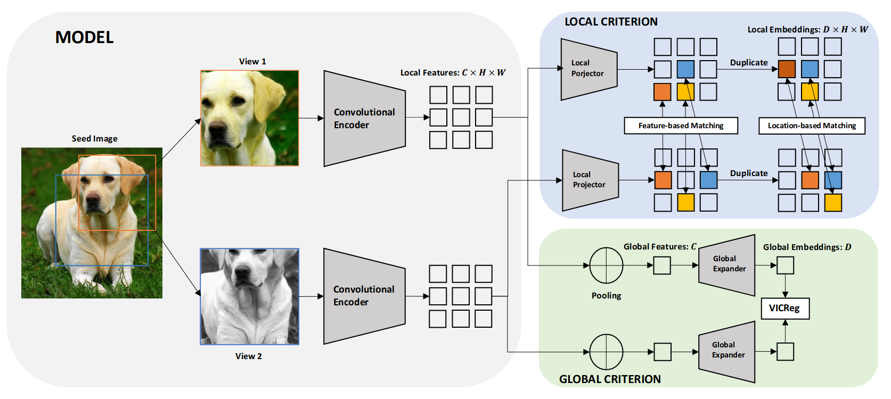

# A simple VICReg & VICRegL implementation

This project is a PyTorch implementation on the
[VICReg](https://arxiv.org/abs/2105.04906) and the [VICRegL](https://arxiv.org/abs/2210.01571).
VICReg introduces a new contrastive loss that is decomposed in three parts:

1. *The invariance loss*, to force the model to produce the same hidden representation
between two embeddings of the same object.
2. *The variance loss*, to force the model to diverse its representations between
the embeddings of different objects.
3. *The covariance loss*, to force the model to encode more information inside its
hidden representations by decorrelating the representation dimensions.

The goal of this repository is to provide a simple and hackable implementation
of this loss.
That way it is easy to copy and paste the code into your own project.

## VICReg

The standard VICReg applies the loss to the global representation of each images.
It can be applied to any kind of model, as long as it provides a single latent representation
for each input.

## VICRegL

This version applies a combinaison of a global and local loss.
The local loss is a VICReg loss but applied to specific patches of an image.
Patches are first matched using a feature or a distance matching function.
The global loss is the same loss as the standard VICReg.

This loss is useful if you have a model that output multiple latent
representation for an image, such as a ViT. Each of these latent representation
can be mapped to a specific patch location in the original image, allowing a
patch matching between two version of the same image.

All credits go to the original paper and the official implementation:

* VICReg: <https://arxiv.org/abs/2105.04906>
* VICRegL: <https://arxiv.org/abs/2210.01571>
* Official VICReg implementation: <https://github.com/facebookresearch/vicreg>
* Official VICRegL implementation: <https://github.com/facebookresearch/VICRegL>
